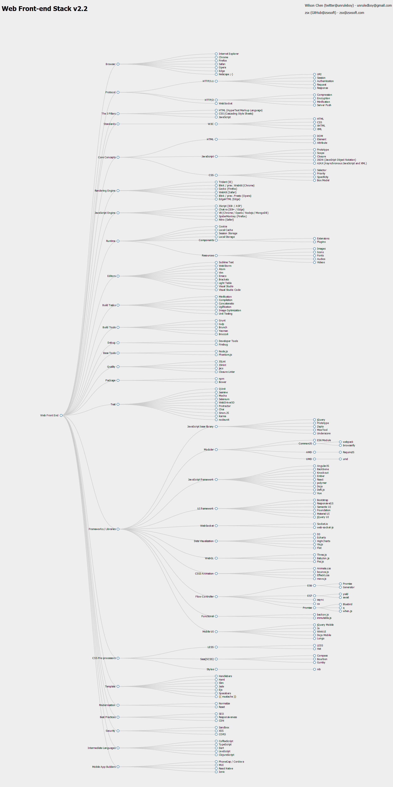

# Localization
中文: 
http://www.cnblogs.com/unruledboy/p/WebFrontEndStack.html


# WebFrontEndStack
Web front-end stack: browsers, platforms, libraries, frameworks, tools etc.



# Generate image yourself

## Prepare for environment
You should have Visual Studio 2010+ installed in Windows. 

1. Install [nodejs](https://nodejs.org).

2. Install [Phantomjs](http://phantomjs.org).

3. Install [Python 2.7](https://www.python.org/).

3. ``npm install``

If the error occurs, you can check the dependence of [phantomjs-node](https://github.com/sgentle/phantomjs-node/wiki), [node-gyp](https://github.com/TooTallNate/node-gyp#installation).

## Run commands
``npm start`` for start a server to open the html directly.

``npm run build`` for generate the image.

Both of commands require port 3000. If you're using this port, then try this:

bash:
```bash
PORT=4000 npm run build
```

cmd:
```cmd
SET PORT=4000
npm run build
```

# What and why?
Have you ever wondered:
* what technologies web front end really includes? 
* how many do I possess?


I could not find a really comprehensive diagram that shows the web front end technology stack, so I come up with my own version.

There might be issues here and there, like the category, the individual ones, but the beautity is you can modify it as you want.

You can have a graphical preview here (use mouse to move / zoom): 

https://rawgit.com/unruledboy/WebFrontEndStack/master/ux/WebFrontEndStack.htm 


# The Web Front End Stack
<!--BUILD_START-->

- Web Front End
	- Browser
		- Internet Explorer
		- Chrome
		- Firefox
		- Safari
		- Opera
		- Edge
		- Netscape ;-)
	- Protocol
		- HTTP/1.1
			- URI
			- Session
			- Authentication
			- Request
			- Response
		- HTTP/2
			- Compression
			- Encryption
			- Minification
			- Server Push
		- WebSocket
	- The 3 Pillars
		- HTML (HyperText Markup Language)
		- CSS (Cascading Style Sheets)
		- JavaScript
	- Standards
		- W3C
			- HTML
			- CSS
			- XHTML
			- XML
	- Core Concepts
		- HTML
			- DOM
			- Element
			- Attribute
		- JavaScript
			- Prototype
			- Scope
			- Closure
			- JSON (JavaSript Object Notation)
			- AJAX (Asynchronous JavaScript and XML)
		- CSS
			- Selector
			- Priority
			- Specificity
			- Box Model
	- Rendering Engine
		- Trident (IE)
		- Blink / prev. WebKit (Chrome)
		- Gecko (Firefox)
		- WebKit (Safari)
		- Blink / prev. Presto (Opera)
		- EdgeHTML (Edge)
	- JavaScript Engine
		- JScript (IE8- / ASP)
		- Chakra (IE9+ / Edge)
		- V8 (Chrome / Opera / Nodejs / MongoDB)
		- SpiderMonkey (Firefox)
		- Nitro (Safari)
	- Runtime
		- Cookie
		- Local Cache
		- Session Storage
		- Local Storage
		- Components
			- Extensions
			- Plugins
		- Resources
			- Images
			- Icons
			- Fonts
			- Audios
			- Videos
	- Editors
		- Sublime Text
		- WebStorm
		- Atom
		- Vim
		- Emacs
		- Brackets
		- Light Table
		- Visual Studio
		- Visual Studio Code
	- Build Tasks
		- Minification
		- Compilation
		- Concatenatio
		- Uglification
		- Image Optimization
		- Unit Testing
	- Build Tools
		- Grunt
		- Gulp
		- Brunch
		- Yeoman
		- Broccoli
	- Debug
		- Developer Tools
		- Firebug
	- Base Tools
		- Node.js
		- Phantom.js
	- Quality
		- JSLint
		- JSHint
		- jscs
		- Closure Linter
	- Package
		- npm
		- Bower
	- Test
		- QUnit
		- Jasmine
		- Mocha
		- Selenium
		- WebDriverJS
		- Protractor
		- Chai
		- Sinon
		- Karma
		- Nodeunit
	- Frameworks/Libraries
		- JavaScript base library
			- jQuery
			- Prototype
			- Zepto
			- MooTool
			- Underscore
		- Modular
			- ES6 Module
			- CommonJS
				- webpack
				- browserify
			- AMD
				- RequireJS
		- JavaScript framework
			- AngularJS
			- Backbone
			- Knockout
			- Ember
			- React
			- polymer
			- Extjs
			- Dojo
			- Deft.js
			- Vue
		- UI framework
			- Bootstrap
			- ZURB
			- YUI
			- Toast
			- YAML
			- ResponsiveGS
			- Semantic UI
			- Foundation
			- Material UI
			- jQuery UI
		- WebSocket
			- Socket.io
			- web-socket-js
		- Data Visualization
			- D3
			- Echarts
			- HighCharts
			- Vis.js
			- Flot
		- WebGL
			- Three.js
			- Babylon.js
			- Pixi.js
		- CSS3 Animation
			- Animate.css
			- bounce.js
			- Effeckt.css
			- move.js
		- Flow Controller
			- ES6
				- Promise
				- Generator
			- ES7
				- yield
				- await
			- async
			- co
			- Promise
				- Bluebird
				- q
				- When.js
		- Functional
			- backon.js
			- immutable.js
		- Mobile UI
			- Sencha
			- jQuery Mobile
			- Kendo UI
			- Jo
			- WinkUI
			- DojoMobile
			- Lungo
	- CSS Pre-processors
		- SCSS
		- LESS
			- Hat
		- SASS
			- Compass
			- Bourbon
			- Gumby
		- Stylus
			- Nib
	- Template
		- Handlebars
		- Haml
		- Slim Ruby
		- Jade
		- Ejs
		- Spacebars
	- Modernisation
		- Normalize
		- Reset
	- Best Practices
		- SEO
		- Responsiveness
		- CDN
	- Security
		- Sandbox
		- XSS
		- CORS
	- Intermediate Languages
		- CoffeeScript
		- TypeScript
		- Dart
		- LiveScript
		- ClojureScript
	- Mobile App Builders
		- PhoneGap / Cordova
		- MUI
		- React Native

<!--BUILD_END-->